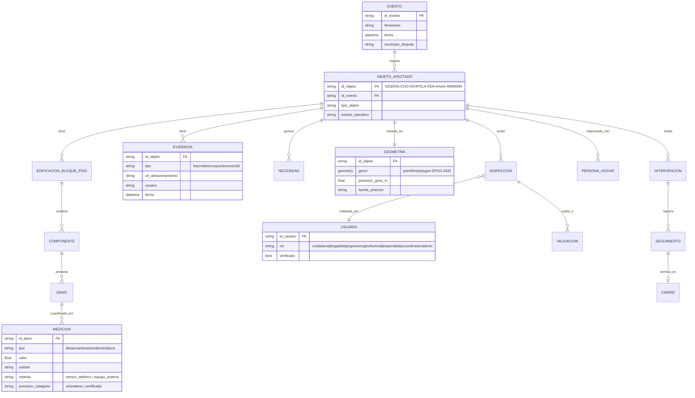

# Modelo de datos conceptual — SIGERIA

Basado en la sección 17 del documento base. Entidades mínimas del MVP en negrita.

## Entidades del MVP (fase 1)

| Entidad | Tabla | Módulo MVP |
|---|---|---|
| Evento | `evento` | 1 |
| ObjetoAfectado | `objeto_afectado` | 1 |
| Geometria | `geometria` | 3 |
| Necesidad | `necesidad` | 2 |
| Evidencia | `evidencia` | 1/2 |
| Medicion | `medicion` | 4 |
| Usuario | `usuario` | 1 (autenticación mínima) |

Entidades de fases posteriores (no en el MVP): `EdificacionBloquePiso`, `Componente`, `Dano`
(detallado por componente), `Inspeccion`, `Validacion`, `PersonaHogar` (RUD), `Servicio`,
`Intervencion`, `Ayuda`, `Seguimiento`, `Cierre`.

## Decisión de base de datos: PostGIS en producción, SQLite en desarrollo local

Esta máquina no tiene PostgreSQL con PostGIS configurado y accesible con
credenciales simples (ver [[proyecto-escuchar-turbo]] y
[[proyecto-transicion-energetica-choco]]: hay un Postgres 18 EDB en :5432 sin
rol `postgres`/PostGIS listo). Para no repetir el mismo bloqueo, el backend:

1. Usa **SQLite + módulo `spatialite` si está disponible, o geometría como WKT/GeoJSON en texto**
   como base de desarrollo por defecto — cero instalación, igual que `db_local.py` de Escuchar Turbo.
2. Expone el mismo `schema.sql` en dialecto PostGIS (`backend/db/schema_postgis.sql`) listo para
   producción, y un `schema_sqlite.sql` equivalente para desarrollo.
3. La capa de acceso a datos (SQLAlchemy) usa tipos que funcionan en ambos motores;
   la geometría se maneja como GeoJSON en columna de texto en SQLite y como `geometry` real
   (GeoAlchemy2) en PostGIS — ver `backend/app/db/base.py`.

## Identificador único de objeto afectado

Formato: `SIGERIA-CHO-<DIVIPOLA>-<FEN>-<AAAA>-<NNNNNN>`
Ejemplo: `SIGERIA-CHO-27001-SIS-2026-000001` (Quibdó, sismo, 2026, consecutivo 1).
No incluye datos personales. `<FEN>` usa código corto: SIS, INU, DES, VEN, INC, ERO, CRE, OTR.
